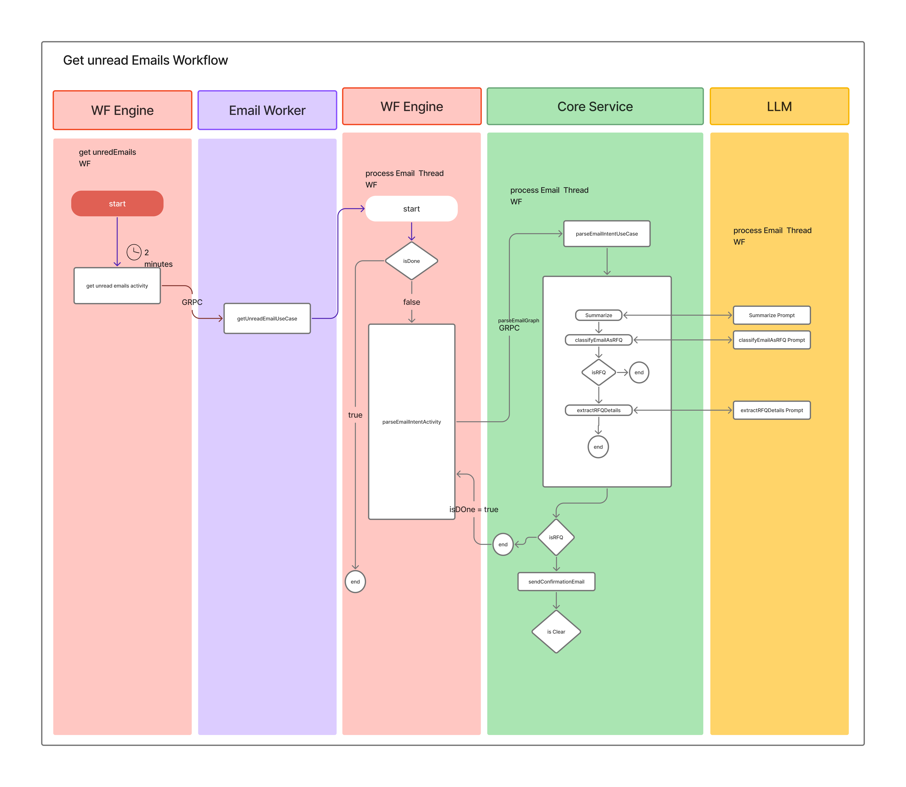

# System Design 

## 📬 Get Unread Emails Workflow

  this flow outlines how unread emails are fetched ,parsed , classified as RFQ or not, summarized and finally parsed to structured data and saved to database.****

---

## 🟥 WF Engine

- **Workflow**: `getUnreadEmailsWF`
- **Trigger**: Every 2 minutes
- **Action**:
  - Starts `get unread emails activity`
  - Sends gRPC request to **Email Worker**
- **Then**: Starts `processEmailThreadWF` for each thread
- **Decision**:
  - If `isDone` → **End**
  - Else → run `parseEmailIntentActivity`

---

## 🟪 Email Worker

- **Handles gRPC request**
- Executes `getUnreadEmailsUseCase`
- Returns unread email threads to WF Engine

---

## 🟥 WF Engine (continued)

- Executes `parseEmailIntentActivity`
- Passes request to Core Service for intent extraction

---

## 🟩 Core Service

- Runs `parseEmailIntentUseCase`
- Delegates to LangGraph (via gRPC) for agentic parsing flow:
  1. **Summarize**
  2. **Classify Email as RFQ**
  3. **If RFQ**, extract RFQ details
- After parsing:
  - Sends confirmation email
  - If `isClear` → **End**

---

## 🟨 LLM (LangGraph Agents)

Supports AI-powered prompt steps:

- 🧠 `SummarizePrompt`
- 🏷️ `classifyEmailAsRFQPrompt`
- 📋 `extractRFQDetailsPrompt`

Each step is defined as a LangGraph node using an LLM and a Zod schema for validation.

---

## 🧩 System Highlights

- **Temporal Workflows** to manage orchestration
- **gRPC** for fast internal service communication
- **LangGraph** for AI-driven, agentic decision making
- **Zod** for structured schema validation
- **MongoDB** via Mongoose for storage
- **LLMs** (OpenAI / Claude / etc.) for email understanding

---

## 🖼️ System Diagram

